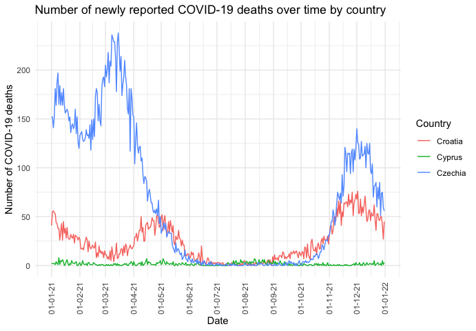

<!-- README.md is generated from README.Rmd. Please edit that file -->

# dsfbnine

<!-- badges: start -->
<!-- badges: end -->

The goal of {dsfbnine} is to help me with data analysis. The functions
included in this package are specific to my own workflow, most were
written by looking at my own duplicate code. The main use of the
functions are to make my code tidier and help me work faster, since I
often do things like plotting illness cases for example.

The package also includes a dataset containing numbers on measles
cases/population per country, called `measlesdata`.

## Installation

You can install the development version of dsfbnine from my [GitHub
repository](https://github.com/nineluijendijk/dsfbnine) with:

``` r
# install.packages("devtools")
devtools::install_github("nineluijendijk/dsfbnine")
```

## Example

This is a basic example of how to generate a graph showing illness
cases:

``` r
library(dsfbnine)
coviddata <- read.csv(here::here("inst/extdata/datacovid.csv"))
illnessPlot(coviddata, countries = c("Croatia", "Cyprus", "Czechia"), years = 2021, parameter = deaths)
```

<div class="figure">


<p class="caption">
Example illness plot.
</p>

</div>

This package also has a vignette, containing examples of every function.

## Additional files

Additional files can be found in the `/inst/extdata/` directory. It
consist of files used to build the vignette, (raw) data for
analysis/plotting, example files and an R script that shows how the
dataset `measlesdata` was cleaned.
